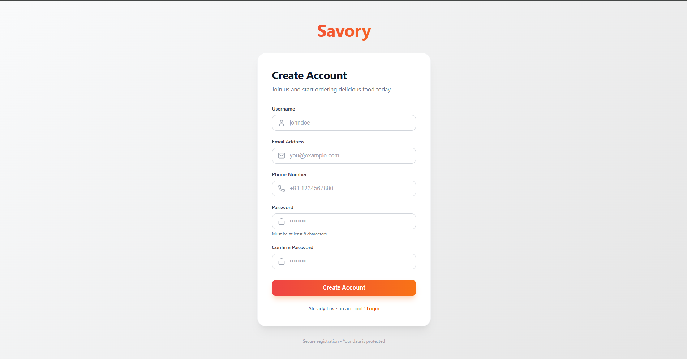
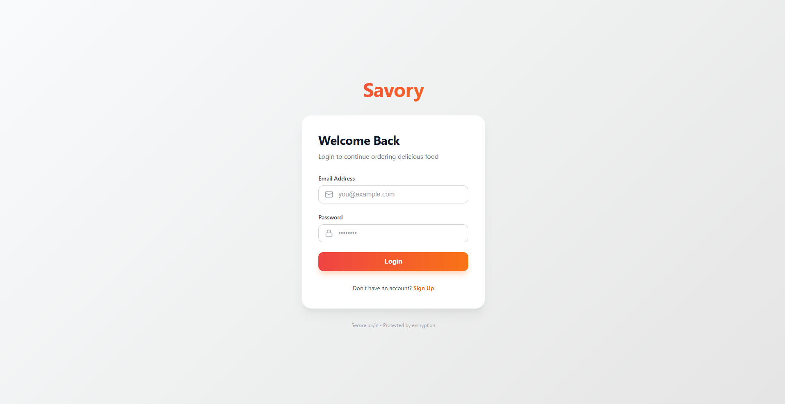
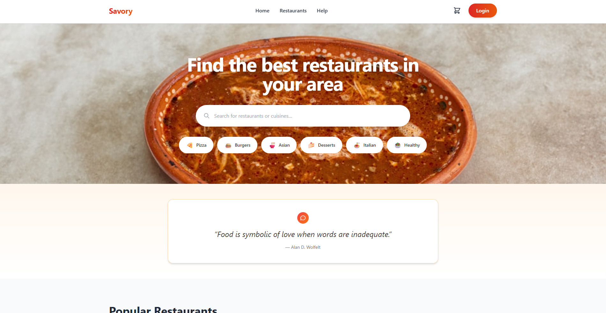
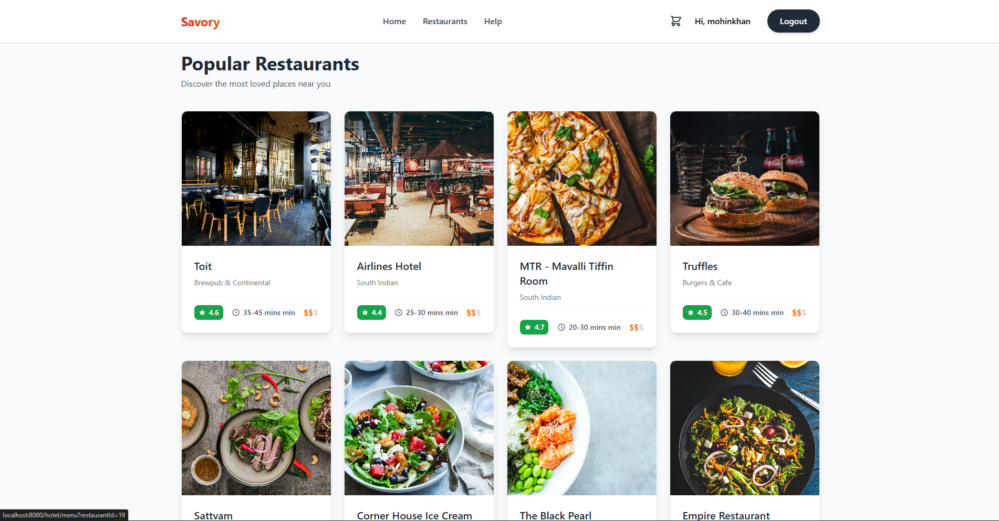
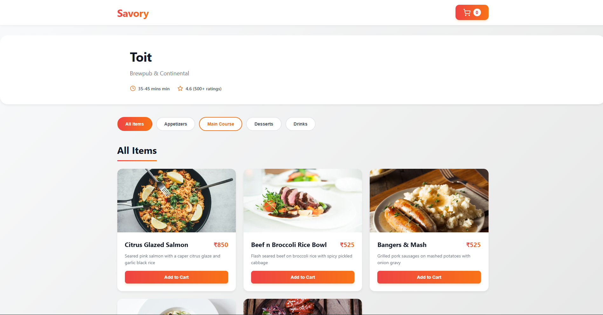
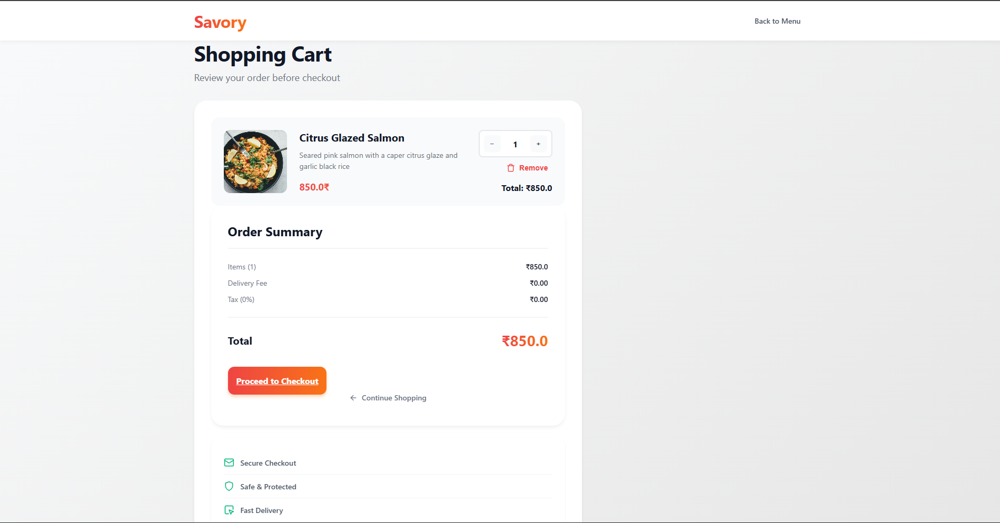
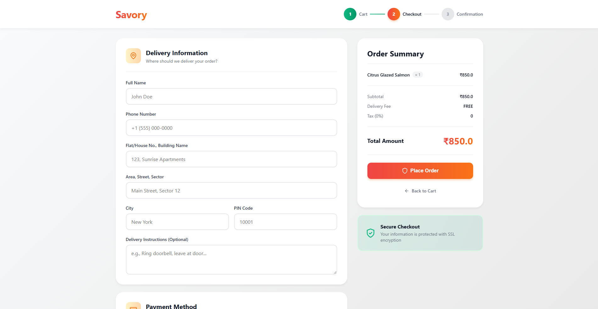
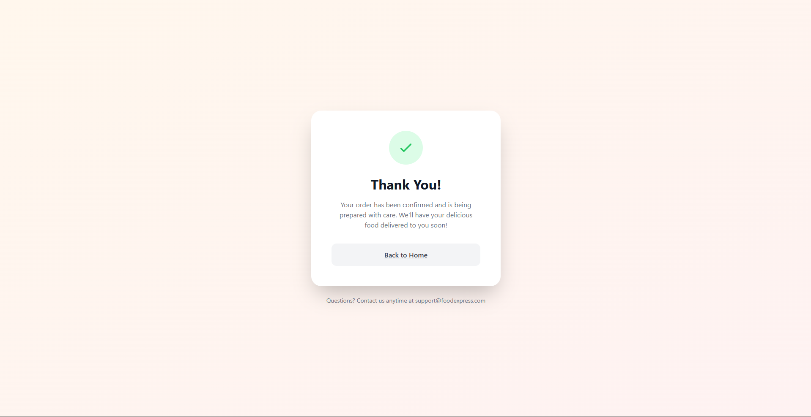

# 🍽️ Food Delivery Web Application

## 📌 Overview
This project is a **Food Delivery Web Application** developed as a **mini-project** using **Java, JEE (Servlets & JSP), and JDBC**. The application simulates a real-world online food ordering platform, allowing users to register, log in, browse menu items, add items to the cart, place orders, and view confirmation.

The project follows an **MVC-based architecture** and uses **JDBC for database connectivity**.

---

## 🏗️ Tech Stack
- **Java (Core & Advanced)**
- **JEE – Servlets & JSP**
- **JDBC – Database Connectivity**
- **MySQL / any RDBMS**
- **HTML / CSS / JSP**
- **Tomcat Server**
- **JDK 8+**

---

## ✨ Features
✔ User Registration & Login  
✔ Secure Session Handling  
✔ Browse Food Menu  
✔ Add / Remove Items from Cart  
✔ Place Orders  
✔ Order Confirmation  
✔ Database-driven operations using JDBC  
✔ Clean Servlet-based backend architecture  

---

## 🧠 Learning Outcomes
This project strengthened my understanding of:

- Java EE Web Application Development  
- JSP–Servlet based MVC Structure  
- Database CRUD Operations using JDBC  
- Session & State Management  
- Form Handling  
- Web Deployment Workflow  

---

## 📸 Screenshots

> Place your screenshots inside a folder named **/screenshots** in the project

## 📸 Screenshots

### 🔐 Register Page  

### 🔑 Login Page  

### 🏠 Home Page  

### 🍕 Menu Page  

### 🛒 Cart Page  

### 💳 Proceed to Checkout  

### 🙏 Thank You Page  

---

## 🗄 Database Structure (Example)
Tables used:

- `user`
- `menu`
- `order`
- `orderitem`
- `restaurant`

---

## ▶️ How to Run the Project

1. Clone or download the repository  
2. Import the project as a **Dynamic Web Project** in Eclipse/IDE  
3. Configure database credentials in JDBC connection file  
4. Create database tables  
5. Deploy on **Apache Tomcat**  
6. Run the application in browser  
---

## 📩 Feedback
I am continuously enhancing this project and welcome any feedback or suggestions.

---

## 🏷️ Tags
`Java` `JEE` `JSP` `JDBC` `Web Development` `Mini Project` `Student Project`
